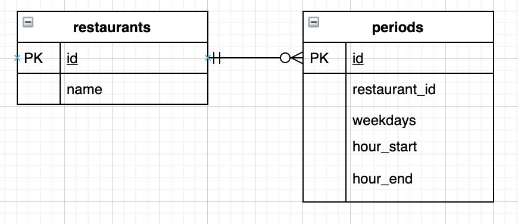

How to run
===

After the souce code was cloned, just type the following commands.

```
bundle && yarn
```

In development environment, make sure you have `postgrseql` installed. Moreover, provider a
database user `postgresql` without password setup by default.

Or if you can modify the config in `db/database.yml` to provide a database user to access
the database.

First time to setup database, just run:

```
rake db:create && rake db:migrate && rake db:seed
```

Now, it's time to run. We first run webpack server in one terminal.

```
bin/webpack-dev-server
```

And run web application in another terminal.

```
rails s
```

Open browser to direct the url to: `localhost:3000/restaurants`


Design Thinking
===



The use case describes user can specify a specific date, and the server should output the restaurants which
are open at that time.

The given date could be separated as two parts, one is weekday, and the other is time.

In order to find those periods which include the user specified (weekday, time) pair, the schema should contain
the columns with `weekdays`, `hour_start` and `hour_end`. `weekdays` are array of integers in the range
1 to 7 (Mon. to Sun.) and `hour_start` and `hour_end` are four characters as HHMM.

If so, it would be better to have a sparate table, called `periods`, contains the columns above. Therefore, the
`restaurants` table which will have one-to-many relationships with `periods` table.

There are some benefits to formalize in this way:

1. The restaurants can be easily find by using simple SQL command like this:

```
SELECT distinct * from restaurants
  join periods where periods.restaurant_id = restaurants.id
  where ?=ANY(periods.weekdays) and
        periods.hour_start <= ? and periods.hour_end >= ?
```

2. It would be easier for a restaurant open in the duration spanned two days

For example, if a restaurant opens at 1900 Wed and close at 0300 Thr, we can create
two `periods`, one is [weekdays=[3], hour_start='1900', hour_end='2400'],
another is [weekdays=[4], hour_start='0000', hour_end='0300'].

3. It would be easier to define multiple weekday with the same open/close time

For example, if a restaurant opens on Wed. through Fri. 09:00 to 18:00, we could only
create one `periods`, which is [weekdays=[3,4,5], hour_start='0900', hour_end='1800']

4. It would be easier to do inverse lookup, i.e. finding restaruants which are not
open at this time.

```
SELECT distinct * from restaruants
  left join periods where periods.restaurant_id = restaurants.id and
    ?=ANY(periods.weekdays) and
    periods.hour_start <= ? and periods.hour_end >= ?
  where
    periods.id is NULL
```


Note that the hours in `periods` table should be UTC. Therefore, if the server locates on different
timezone, we need to convert the query time to UTC before searching through database.
