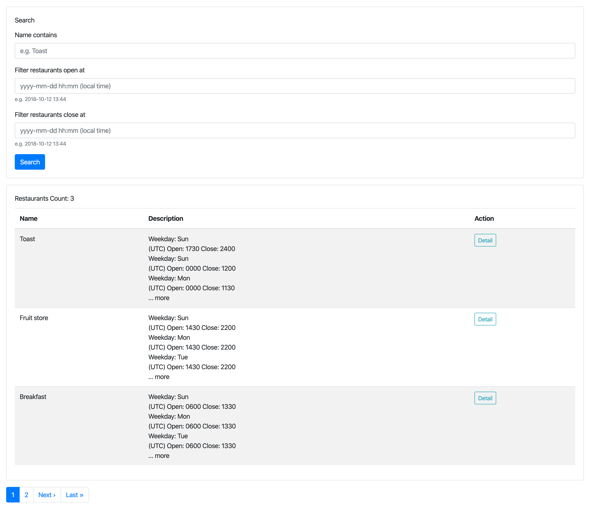

How to run
===

After the souce code was cloned, just type the following commands.

```
bundle && yarn
```

In development environment, make sure you have `postgrseql` installed. Moreover, provider a
database user `postgresql` without password setup by default.

Or if you can modify the config in `db/database.yml` to provide a database user to access
the database.

First time to setup database, just run:

```
rake db:create && rake db:migrate && rake db:seed
```

Now, it's time to run. We first run webpack server in one terminal.

```
bin/webpack-dev-server
```

And run web application in another terminal.

```
rails s
```

Open browser to direct the url to: `localhost:3000/restaurants`


Design Thinking
===


The use case describes user can specify a specific date, and the server should output the restaurants which
are open at that time.

The given date could be separated as two parts, one is weekday, and the other is time.

In order to find those periods which include the user specified (weekday, time) pair, the schema should contain
the columns with `weekdays`, `hour_start` and `hour_end`. `weekdays` are array of integers in the range
1 to 7 (Mon. to Sun.) and `hour_start` and `hour_end` are four characters as HHMM.

If so, it would be better to have a sparate table, called `periods`, contains the columns above. Therefore, the
`restaurants` table which will have one-to-many relationships with `periods` table.

There are some benefits to formalize in this way:

1. The restaurants can be easily find by using simple SQL command like this:

```
SELECT distinct * from restaurants
  join periods where periods.restaurant_id = restaurants.id
  where ?=ANY(periods.weekdays) and
        periods.hour_start <= ? and periods.hour_end >= ?
```

2. It would be easier for a restaurant open in the duration spanned two days

For example, if a restaurant opens at 1900 Wed and close at 0300 Thr, we can create
two `periods`, one is [weekdays=[3], hour_start='1900', hour_end='2400'],
another is [weekdays=[4], hour_start='0000', hour_end='0300'].

3. It would be easier to define multiple weekday with the same open/close time

For example, if a restaurant opens on Wed. through Fri. 09:00 to 18:00, we could only
create one `periods`, which is [weekdays=[3,4,5], hour_start='0900', hour_end='1800']

4. It would be easier to do inverse lookup, i.e. finding restaruants which are not
open at this time.

```
SELECT distinct * from restaruants
  left join periods where periods.restaurant_id = restaurants.id and
    ?=ANY(periods.weekdays) and
    periods.hour_start <= ? and periods.hour_end >= ?
  where
    periods.id is NULL
```


Note that the hours in `periods` table should be UTC. Therefore, if the server locates on different
timezone, we need to convert the query time to UTC before searching through database.


Future Work
===

Normally, a restaurant will have the same open/close period among weekdays. It would be better
to write a script to merge `periods`.

For example, a restaurant may have three `periods` like this:

- weekdays: [1], hour_start: 0800, hour_end: 1700
- weekdays: [2], hour_start: 0800, hour_end: 1700
- weekdays: [3], hour_start: 0800, hour_end: 1700

So, we should merage three into one `periods`, and it becomes:

- weekdays: [1,2,3], hour_start: 0800, hour_end: 1700

The merge script can be triggered depends on the scenario:

- before a restaurnt is saved
- data importing


Questions
===

1. What if we have a large number of restaurants, does it still work?

For insert/update/delete part, MVCC part could handle it unless we disable autovacuum.

For query part, since we paginate the query, normally it would not cause trouble. But I did
calculate the count of total records. In Postgresql MVCC architecture, `count` will perform
table scan, in this case, we have to ignore to calculate the total count. This part is used
in the text `Restaurant Count: xx` above the table on UI.

Well, the answer above bases on the current scenario, if things go complicated, we would need
to re-evaluate it again. For example, the restauarnts may be heavily updated, which would
introduce some locks on records, may block the query somehow.

By the way, schema change need more cautions on large table. For example, add a column with
index or with default value ... etc. That is the worst part in Postgres, while MySQL normally
has no such issue.


2. What if we have a large amount of users, does it still work?

If there are really too many users rush into Rails, usually, the app server will be getting
slow and then unresponsive. In this case, we may add a `nginx` server before that to set a
connection limit to protect the app server behind it.

Of course, we can scale up horizontally for the app servers to receive more traffic.

As for to increase the throughput for a app server, we can add a cache layer to return the
result immediately to relieve database loading and any further processing in app server.

What to cache? Well, normally the restaurant data does not always change. User may give a specific
time to query the opened restaurants. Therefore, we can use bucket style cache to cache the result.

For example, if one user gives a query at `2020-04-12 12:10`, the result `R` will be saved in cache
server with the key as time align to `Sun-1200`, and the value is the `R`.

Another user performs a query at `2020-04-19 12:30`, and we calculate the key as `Sun-1200`, assume
the data will not be changed within 30 min, the use should get the same result `R`.

Of cause, the key should be given a expire time, may be 5 minute, to make sure any change applied should
be reflected some time later.

Actually, the cache is kind of hard because there is always some edge restaurant that will located at the
boundary. Here, I only provide some basic idea.
